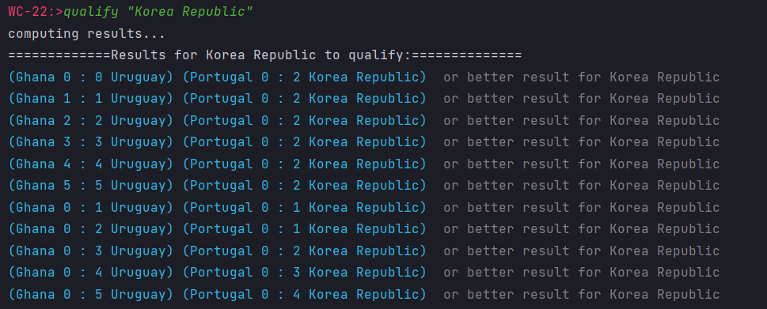
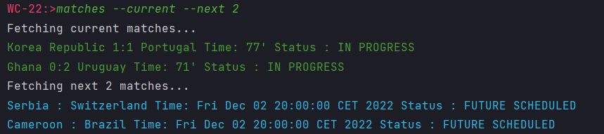

## How to use  (todo)

**Prerequisite:**

Java 17 or Docker

**Build gradle project**

`gradle build`

`java -jar qualification-0.0.1-SNAPSHOT.jar`

In the world cup shell:

`help <Command>`

Press `<TAB>` for autocompletion (for options and values as well)

World Cup Commands:

* ls: List world cup team names.
* qualify: Prints the needed results for a team to qualify.
* standings: Lists groups standings.
* matches: Lists current and/or previous matches. 

Example:

TODO:
1. [X] current and next matches
2. [ ] live score
3. [ ] dashboard for fixtures
4. [ ] live lineups 
5. [ ] add cache to database
6. [ ] add Trie for autocompletion
7. [ ] add docker
8. [ ] add progress bar
9. [ ] add tests

Used API for fetching data: [estiens/world_cup_json](https://github.com/estiens/world_cup_json)
